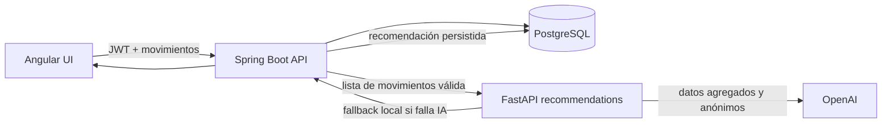

# SmartBancs

Aplicación bancaria demostrativa con Angular, Spring Boot, PostgreSQL y un microservicio Python para generar recomendaciones financieras educativas.

La aplicación permite registrar usuarios, iniciar sesión con JWT, consultar saldo y movimientos, ejecutar operaciones simuladas con idempotencia y solicitar recomendaciones basadas en los movimientos de la cuenta autenticada.


## Arquitectura



### Componentes

- `SmartBanc-Frontend`: SPA Angular 21 con componentes standalone, formularios reactivos y servicios HTTP.
- `src/main/java`: API Spring Boot 4.1.1, autenticación JWT, operaciones bancarias, persistencia JPA y orquestación de recomendaciones.
- `services/recommendations`: microservicio FastAPI que procesa movimientos, construye los agregados financieros y llama a OpenAI.
- `database/init`: esquema inicial de PostgreSQL.
- `etl`: transformación opcional de transacciones de ejemplo.
- `infra`: Dockerfiles y configuración de Nginx.
- `observability`: Prometheus y Grafana para observabilidad local.
- `tests`: colección Postman para probar el flujo de la API.

## Requisitos

- Docker Desktop con Docker Compose.
- Java 21.
- Node.js 22 y npm.
- Python 3.12 solo si se ejecuta el microservicio fuera de Docker.

## Ejecución con Docker Compose

Desde la raíz del repositorio:

```powershell
$env:JWT_SECRET = "cambia-esta-clave-por-una-secreta-de-al-menos-32-bytes"
# Opcional: habilita OpenAI. Sin estas variables se usa el fallback local.
$env:OPENAI_API_KEY = "sk-..."
$env:OPENAI_MODEL = "gpt-4o"

docker compose up -d --build --wait
```

La aplicación web queda disponible en `http://localhost:8088`.

Servicios publicados al host:

| Servicio | URL | Uso |
| --- | --- | --- |
| Aplicación | `http://localhost:8088` | Frontend Angular servido por Nginx |
| Prometheus | `http://localhost:9090` | Métricas locales |
| Grafana | `http://localhost:3000` | Dashboards locales |

PostgreSQL y el microservicio `recommendations` solo son accesibles dentro de la red de Compose. El puerto `8000` de Python no se publica al host; Spring lo consume mediante `http://recommendations:8000`.

Para detener los servicios sin borrar datos:

```powershell
docker compose down
```

No usar `docker compose down -v` si se desea conservar la base de datos.

## Ejecución local

### PostgreSQL

```powershell
docker compose up -d postgres --wait
```

La base de datos local usa:

- Host: `localhost`
- Puerto: `5432`
- Base de datos: `smartbancs`
- Usuario: `smartbancs`
- Contraseña local: `smartbancs_local`

### Backend Spring Boot

Desde la raíz:

```powershell
.\mvnw.cmd spring-boot:run
```

El backend utiliza el puerto `8080`. También puede ejecutarse la clase `SmartBancsAppApplication` desde el IDE.

Variables útiles:

| Variable | Descripción |
| --- | --- |
| `JWT_SECRET` | Secreto Base64 para firmar JWT. En una instalación persistente debe mantenerse estable y tener al menos 32 bytes. |
| `RECOMMENDATIONS_URL` | URL del microservicio Python. Por defecto `http://localhost:8000`. En Compose es `http://recommendations:8000`. |
| `SPRING_DATASOURCE_URL` | URL JDBC de PostgreSQL. |
| `SPRING_DATASOURCE_USERNAME` | Usuario de PostgreSQL. |
| `SPRING_DATASOURCE_PASSWORD` | Contraseña de PostgreSQL. |

### Frontend Angular

En otra terminal:

```powershell
Set-Location .\SmartBanc-Frontend
npm install
npm start
```

Abrir `http://localhost:4200`. El frontend espera el backend en la URL definida en `SmartBanc-Frontend/src/app/lib/api.config.ts`.

### Microservicio Python fuera de Docker

```powershell
Set-Location .\services\recommendations
python -m venv .venv
.\.venv\Scripts\Activate.ps1
pip install -r requirements.txt
$env:OPENAI_MODEL = "gpt-4o"
# Opcional: $env:OPENAI_API_KEY = "sk-..."
python -m uvicorn app:app --host 0.0.0.0 --port 8000
```

El endpoint de salud es `GET http://localhost:8000/health`.

## Flujo de recomendaciones

1. Angular carga los movimientos que ya tiene en memoria y el usuario pulsa **Pedir recomendación** en el panel de operaciones.
2. Angular envía la lista a `POST /recommendations/refresh` con el JWT en `Authorization: Bearer <token>`.
3. Spring obtiene la cuenta desde el JWT, no desde el cuerpo de la petición.
4. Spring filtra movimientos nulos, inválidos o que no pertenezcan a la cuenta autenticada.
5. Spring responde `202 Accepted` y procesa la generación en un executor asíncrono. La operación bancaria no espera a OpenAI.
6. Spring reenvía a Python la lista de movimientos válida, sin convertirla a un DTO de agregados.
7. Python calcula ingresos, gastos, ahorro, proporción de gastos, cantidad de movimientos y categorías del periodo más reciente.
8. Si hay credenciales, Python solicita recomendaciones educativas a OpenAI usando `OPENAI_MODEL` o `gpt-4o` por defecto.
9. Si falta la API key, OpenAI falla o devuelve una respuesta inválida, Python usa reglas locales y devuelve `source: "fallback"`.
10. Spring guarda cada recomendación asociada a la cuenta autenticada y Angular consulta la última recomendación para mostrarla en la tarjeta del dashboard.

OpenAI nunca se llama desde Angular ni desde Spring. La API key solo se lee en Python mediante `OPENAI_API_KEY` o `API_KEY`.

## API de recomendaciones

Todas las rutas requieren JWT, excepto el endpoint de salud del microservicio Python.

### Solicitar actualización

```http
POST /recommendations/refresh
Authorization: Bearer <access-token>
Content-Type: application/json
```

Respuesta: `202 Accepted`.

Cuerpo:

```json
[
  {
    "transactionId": "uuid",
    "sourceAccountNumber": "10000001",
    "destinationAccountNumber": null,
    "amount": 80,
    "type": "withdraw",
    "serviceCode": null,
    "createdAt": "2026-09-21T02:36:05.363115Z"
  }
]
```

El cuerpo no debe incluir contraseñas, JWT, correo, nombre u otros datos personales.

### Consultar última recomendación

```http
GET /recommendations
Authorization: Bearer <access-token>
```

- `200 OK`: devuelve la última recomendación persistida de la cuenta autenticada.
- `204 No Content`: todavía no existe una recomendación para esa cuenta.

### Respuesta persistida

```json
{
  "id": "uuid",
  "accountNumber": "10000001",
  "title": "Construye un fondo de emergencia",
  "message": "Puedes separar una parte de tus ingresos mensuales.",
  "priority": "medium",
  "category": "saving",
  "modelName": "gpt-4o",
  "promptVersion": "recommendations-v1",
  "source": "openai",
  "createdAt": "2026-09-21T02:40:00Z"
}
```

El microservicio Python expone `POST /recommendations` y devuelve entre una y tres recomendaciones con `title`, `message`, `priority` y `category`. El prompt limita la respuesta a educación financiera: no inventa información, no recomienda inversiones específicas, no promete rendimientos, no ejecuta transacciones ni solicita información personal.

## API bancaria principal

Las rutas protegidas utilizan `Authorization: Bearer <access-token>`.

| Método | Ruta | Descripción |
| --- | --- | --- |
| `POST` | `/users` | Registra un usuario y crea su cuenta. |
| `POST` | `/auth/login` | Inicia sesión y devuelve un JWT. |
| `GET` | `/users/{accountNumber}` | Consulta el perfil de la cuenta autenticada. |
| `GET` | `/transactions` | Consulta movimientos de la cuenta autenticada. |
| `POST` | `/transactions/deposits` | Registra un depósito simulado. |
| `POST` | `/transactions/withdrawals` | Registra un retiro. |
| `POST` | `/transactions/transfers` | Registra una transferencia. |
| `POST` | `/transactions/service-payments` | Registra un pago de servicio simulado. |
| `GET` | `/integration/bancs/status` | Consulta el estado de la outbox de integración. |

Las operaciones mutables requieren un `Idempotency-Key` UUID. Los importes se validan y se manejan con precisión decimal en Java/PostgreSQL.

## Seguridad y datos

- El JWT identifica la cuenta autenticada y se valida en cada acceso protegido.
- El frontend mantiene el JWT únicamente en memoria; no lo guarda en `localStorage`, `sessionStorage` ni cookies.
- Spring valida la titularidad de la cuenta antes de consultar movimientos u operar.
- Los movimientos enviados al servicio de recomendaciones se filtran por cuenta y solo contienen los campos necesarios para el cálculo.
- Las contraseñas no se envían al servicio Python ni a OpenAI.
- No se deben subir API keys, `JWT_SECRET` ni contraseñas reales al repositorio.
- Las recomendaciones son informativas y no pueden modificar saldos ni ejecutar operaciones.

## Verificación

### Backend

```powershell
.\mvnw.cmd test
.\mvnw.cmd package
```

### Frontend

```powershell
Set-Location .\SmartBanc-Frontend
npm run build
```

### Python

```powershell
python -m py_compile .\services\recommendations\app.py
```

Prueba rápida del fallback dentro del contenedor, sin consumir OpenAI:

```powershell
docker compose exec recommendations python -c "import json, urllib.request; data=[{'transactionId':'demo','sourceAccountNumber':'10000001','destinationAccountNumber':None,'amount':80,'type':'withdraw','serviceCode':None,'createdAt':'2026-09-21T02:36:05.363115Z'}]; request=urllib.request.Request('http://127.0.0.1:8000/recommendations', data=json.dumps(data).encode(), headers={'Content-Type':'application/json'}); print(urllib.request.urlopen(request).read().decode())"
```

### Compose

```powershell
docker compose config
```

El flujo completo se valida registrando un usuario, iniciando sesión, ejecutando una operación, solicitando una recomendación desde el dashboard y comprobando que la tarjeta se actualice. Con las variables de OpenAI ausentes, el resultado esperado es `source: "fallback"`.

## Documentación adicional

- [API detallada](docs/API.md)
- [Recomendaciones financieras con IA](docs/AI-RECOMMENDATIONS.md)
- [Configuración local](LOCAL_SETUP.md)
- [Documentación de base de datos](database/README.md)
- [Colección Postman](tests/SmartBancs.postman_collection.json)

## Uso de IA en el desarrollo

Se utilizó inteligencia artificial como apoyo para el diseño y la implementación de la interfaz de usuario del frontend Angular: composición visual del dashboard, tarjeta de recomendaciones, panel de operaciones, jerarquía de contenidos y textos de interfaz.

La decisión de arquitectura mantiene la IA financiera aislada en el microservicio Python. Angular no llama a OpenAI ni recibe la API key. Las recomendaciones se generan únicamente a partir de los movimientos autorizados de la cuenta, y el resultado se revisa y valida mediante las reglas de negocio del backend, la persistencia y el fallback local.

## Alcance y limitaciones

- La integración con Bancs utiliza un adaptador local simulado.
- Depósitos y pagos no representan transacciones reales.
- El flujo de cambio de contraseña es de demostración y no es recuperación por correo.
- La generación de recomendaciones es asíncrona; después de solicitarla puede ser necesario actualizar la tarjeta para ver el resultado.
- Para producción se necesitarían secretos gestionados externamente, HTTPS, controles de acceso más completos, auditoría, límites de uso y monitoreo operativo.
