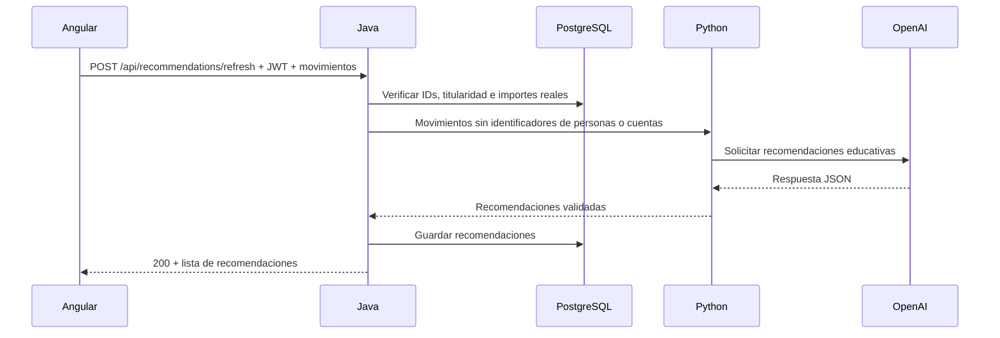

# SmartBancs App — MVP

Demo bancaria con Angular 21, Java 21 / Spring Boot, PostgreSQL y un servicio Python de recomendaciones con OpenAI. Incluye registro, acceso por **correo y contraseña**, saldo, depósitos, retiros, transferencias, pagos de servicios y movimientos.

Los importes se manejan con `BigDecimal` y `NUMERIC(15,2)`. Las operaciones bancarias usan transacciones de base de datos e idempotencia. Los depósitos, pagos y la integración Bancs son simulaciones.

## 1. Requisitos

- Docker Desktop iniciado, con contenedores Linux y Docker Compose v2.
- PowerShell para usar el script de arranque en Windows.
- Internet para descargar imágenes y dependencias durante la primera construcción.
- Puertos libres: **8088**, **9090** y **3000**.
- Una clave de OpenAI con acceso al modelo configurado, solo para probar recomendaciones con IA.

**No necesitas instalar Java, Node.js, Maven ni Python en tu máquina para ejecutar todo con Compose**: se instalan dentro de las imágenes. No hace falta crear una base de datos en AWS.

## 2. Primer arranque

Abre PowerShell en la raíz del repositorio:

```powershell
Set-Location C:\Users\francisco\Desktop\smartbancs-challenge
powershell -NoProfile -ExecutionPolicy Bypass -File .\scripts\start.ps1 -ConfigureOnly
```

El script crea `.env` desde `.env.example` y genera un secreto JWT aleatorio de 32 bytes en Base64. **Si `.env` ya existe, lo conserva íntegro.** `ExecutionPolicy Bypass` afecta únicamente a este proceso; no cambia la política global de PowerShell.

Edita `.env` y configura tu clave si vas a probar IA:

```dotenv
OPENAI_API_KEY=tu_clave_real
OPENAI_MODEL=gpt-4o
```

No uses literalmente `tu_clave_real`. Si ya utilizas `API_KEY`, sigue siendo compatible; `OPENAI_API_KEY` tiene prioridad. No compartas ni subas `.env` al repositorio.

Después ejecuta:

```powershell
powershell -NoProfile -ExecutionPolicy Bypass -File .\scripts\start.ps1
```

El script valida Docker y Compose, construye las imágenes, levanta los seis servicios, espera sus comprobaciones de salud, verifica que existan las seis tablas principales y consulta la salud de Java a través de Nginx. No borra volúmenes, no crea usuarios bancarios y no ejecuta migraciones sobre una base existente. La primera construcción puede tardar varios minutos.

Si no necesitas IA todavía, puedes dejar la clave vacía y arrancar la banca. Una solicitud de recomendaciones con movimientos mostrará un error mientras no exista una clave válida. Sin movimientos se muestra orientación general identificada como **sin IA**.

### Arranque manual, sin el script

Tras preparar `.env`:

```powershell
docker compose config --quiet
docker compose up -d --build --wait --wait-timeout 240
docker compose ps
Invoke-RestMethod http://localhost:8088/api/health
```

La última llamada debe devolver `OK`. Evita imprimir `docker compose config` sin `--quiet` al compartir diagnósticos: puede mostrar los secretos resueltos.

## 3. Accesos

| Componente | Dirección | Qué comprobar |
| --- | --- | --- |
| Aplicación Angular | http://localhost:8088 | Pantalla de ingreso y registro |
| API a través de Nginx | http://localhost:8088/api | URL base para Postman |
| Salud de Java | http://localhost:8088/api/health | Texto `OK` |
| Prometheus | http://localhost:9090 | En Targets, el backend debe aparecer `UP` |
| Grafana | http://localhost:3000 | Usuario `admin`; clave `GRAFANA_ADMIN_PASSWORD` de `.env` |

La clave de Grafana por defecto de la demo es `smartbancs_local`. Su datasource Prometheus se provisiona automáticamente; esto no implica que haya dashboards importados. En volúmenes existentes, cambiar la variable de contraseña no cambia automáticamente el usuario ya creado en Grafana.

Java (`8080`), PostgreSQL (`5432`) y Python (`8000`) **no publican puertos al host** con el Compose actual. Se comunican por la red interna. Usa `/api` a través de Nginx; la URL del frontend está centralizada en [api.config.ts](SmartBanc-Frontend/src/app/lib/api.config.ts).

## 4. Prueba visual completa

Utiliza dos usuarios nuevos para que los saldos iniciales sean cero. Los números de cuenta se generan automáticamente y tienen ocho dígitos; no hay que introducir IDs UUID.

1. Abre http://localhost:8088 y registra a **María**, con un correo que no exista y una contraseña de al menos ocho caracteres. Inicia sesión y anota su número de cuenta. Cierra sesión.
2. Registra a **Pepito** con otro correo e inicia sesión. Comprueba que se muestren su nombre, cuenta y saldo `0,00`.
3. Ejecuta las operaciones de la tabla desde la cuenta de Pepito. En la transferencia escribe la cuenta de María, pulsa **Consultar**, comprueba el nombre y confirma.

| Paso | Operación | Importe | Saldo esperado de Pepito | Saldo esperado de María |
| --- | --- | ---: | ---: | ---: |
| 1 | Depositar en Pepito | 1000,00 | 1000,00 | 0,00 |
| 2 | Retirar de Pepito | 100,00 | 900,00 | 0,00 |
| 3 | Transferir a María | 125,50 | 774,50 | 125,50 |
| 4 | Pagar AGUA, referencia `DEMO-001` | 25,50 | 749,00 | 125,50 |

4. Revisa los cuatro movimientos de Pepito. Cierra sesión e ingresa con el correo de María: debe ver `125,50` y la transferencia recibida.
5. Vuelve a Pepito e intenta retirar `1000,00`: debe rechazarse por saldo insuficiente, sin cambiar el saldo ni crear otro movimiento.
6. Desde **Configuración**, cambia el correo. Para el siguiente ingreso utiliza el correo nuevo. Prueba también el cambio de contraseña: exige la anterior y dos copias de la nueva; después debes iniciar sesión otra vez.
7. Recarga la página: el JWT se conserva solo en memoria, por lo que tendrás que iniciar sesión nuevamente. Esto es parte del comportamiento del MVP.

No utilices los registros SQL `DEMO_LOGIN_DISABLED` para ingresar: registra usuarios desde la interfaz. No ejecutes los scripts antiguos de demo de cuentas largas para esta prueba.

### Probar recomendaciones con IA

Con Pepito autenticado y movimientos registrados, pulsa **Pedir recomendaciones**. El botón debe permanecer en **Analizando…** hasta recibir la respuesta y mostrar hasta tres recomendaciones con origen `OpenAI`.



- El botón analiza como máximo los últimos 100 movimientos; no calcula necesariamente el saldo total ni un mes completo.
- Python recibe importe, tipo, dirección de ingreso/egreso, servicio y fecha. No recibe JWT, contraseñas, cuentas, nombres, correos ni referencias de clientes.
- El botón espera una respuesta **200**; ya no utiliza `202` ni una espera fija de 1,2 segundos.
- Python espera hasta 25 segundos al proveedor y Java hasta 35 segundos a Python.
- Sin movimientos: orientación general con `source: fallback`. Con movimientos y clave ausente, fallo del proveedor o respuesta inválida: error visible, sin presentar un texto fijo como IA.
- También existe un listener que solicita recomendaciones en segundo plano después de confirmar transacciones. Con la clave configurada, **las operaciones de la demo pueden producir llamadas adicionales a OpenAI y consumo de API**, además de las del botón.

El prompt pide recomendaciones educativas. Las respuestas del modelo pueden equivocarse; no ejecutan operaciones bancarias ni modifican saldos.

## 5. Probar la API con Postman

1. Importa [tests/SmartBancs.postman_collection.json](tests/SmartBancs.postman_collection.json).
2. La variable de colección `baseUrl` debe ser `http://localhost:8088/api` para Compose.
3. Ejecuta la colección desde el principio. Crea usuarios con correos nuevos, guarda sus cuentas y obtiene sus JWT automáticamente. Esta prueba crea sus propios datos, independientes de la prueba visual.
4. No repitas una solicitud marcada como operación **NUEVA** para comprobar idempotencia: usa su solicitud **REINTENTO**, que conserva la misma clave y el mismo cuerpo.

| Caso | Resultado esperado |
| --- | --- |
| Login con `{ "email": "correo registrado", "password": "contraseña" }` | `200`, JWT y número de cuenta |
| Operación nueva válida, con JWT e `Idempotency-Key` UUID | `201` |
| Repetir clave y cuerpo de una operación confirmada | `200`, mismo movimiento, sin volver a modificar saldo |
| Reutilizar clave con otro importe/cuerpo | `409` |
| Retiro sin saldo | `409`, sin movimiento nuevo |
| Importe con fracción de centavo, por ejemplo `10.005` | `400` |
| Consultar una ruta protegida sin JWT | `401` |
| Consultar u operar la cuenta de otro usuario | `403` |

`Idempotency-Key` se exige en depósitos, retiros, transferencias y pagos; no en registro, login ni recomendaciones. Un JWT caducado requiere volver a ingresar. Un cambio de contraseña invalida los tokens anteriores.

### Recomendaciones desde Postman

Con el JWT de Pepito en `Authorization: Bearer <token>`:

1. `GET {{baseUrl}}/transactions`: copia el array de movimientos de ese usuario.
2. `POST {{baseUrl}}/recommendations/refresh`, Body → raw → JSON: pega hasta 100 movimientos. Java valida sus IDs y obtiene los importes reales desde PostgreSQL.
3. Espera `200` con un array de recomendaciones. `GET {{baseUrl}}/recommendations` devuelve la última guardada (`204` si no existe).

El servicio Python es interno; Postman debe llamar a Java. No envíes la clave OpenAI desde Postman ni Angular.

## 6. Base de datos y reinicios

En una instalación nueva, PostgreSQL ejecuta [database/init/database.sql](database/init/database.sql) al crear su volumen. Incluye usuarios, cuentas, catálogo AGUA/LUZ/INTERNET, transacciones, recomendaciones e integración Bancs.

En un volumen existente **los scripts de inicialización no vuelven a ejecutarse**. `CREATE TABLE IF NOT EXISTS` tampoco actualiza la estructura de una tabla anterior. El script de arranque comprueba la presencia de tablas, pero no valida todas sus columnas ni aplica migraciones.

Para inspeccionar sin modificar datos:

```powershell
docker compose exec postgres psql -U smartbancs -d smartbancs -c '\dt'
docker compose exec postgres psql -U smartbancs -d smartbancs -c '\d transactions'
docker compose logs --tail=80 postgres backend
```

Si aparece `relation does not exist`, revisa los logs de la primera inicialización y compara el esquema existente con `database.sql`. Una base antigua necesita una migración acorde a su estructura; volver a ejecutar Compose no la corrige. El script no borra datos ni aplica automáticamente los SQL históricos.

Para comprobar desde cero sin eliminar el volumen actual, puedes usar **otro nombre de proyecto**. Detén primero el proyecto normal para liberar puertos:

```powershell
docker compose down
docker compose -p smartbancs-clean up -d --build --wait --wait-timeout 240
# Al terminar la prueba aislada:
docker compose -p smartbancs-clean down
docker compose up -d --wait
```

`smartbancs-clean` usa otros volúmenes; será una instalación nueva solamente la primera vez que uses ese nombre. Los datos del proyecto normal se conservan. No uses `down -v` para detener la demo: elimina los volúmenes del proyecto.

## 7. Operación y diagnóstico

```powershell
# Estado y logs (no imprimir .env)
docker compose ps
docker compose logs --tail=80 backend recommendations

# Reconstruir despues de cambiar codigo o variables de entorno
docker compose up -d --build --wait

# Detener conservando los datos
docker compose down

# Volver a iniciar sin reconstruir
docker compose up -d --wait
```

| Problema | Acción |
| --- | --- |
| Docker no responde | Abre Docker Desktop, activa contenedores Linux y espera a que inicie el motor. |
| Puerto ocupado | Detén el proceso o el otro proyecto que utiliza 8088, 9090 o 3000. |
| Backend no llega a saludable | Revisa `docker compose logs --tail=80 backend postgres`. Comprueba esquema y `JWT_SECRET`. |
| `JWT_SECRET` inválido | Debe contener Base64 válido de al menos 32 bytes aleatorios, no una frase. El script genera uno solo al crear `.env`; no reemplaza archivos existentes. Si lo dejas vacío, Java genera una clave temporal y las sesiones no sobreviven a su reinicio. |
| Recomendaciones con error | Revisa los logs de `recommendations` y `backend`, la clave, el acceso al modelo y la disponibilidad del proveedor. Que `/health` esté `UP` no valida la clave OpenAI. |
| Cambié `.env` y sigue igual | Recrea con `docker compose up -d --build --wait`; `restart` no incorpora nuevas variables de Compose. Las variables exportadas en la terminal pueden tener prioridad sobre `.env`. |
| Frontend sin cambios | Reconstruye `nginx` y recarga el navegador; Nginx sirve los archivos compilados. |

## 8. Arquitectura y alcance

| Carpeta | Responsabilidad |
| --- | --- |
| `SmartBanc-Frontend` | Interfaz Angular y llamadas a `/api` |
| `src/main/java` | Autenticación, reglas bancarias, persistencia y comunicación con Python |
| `services/recommendations` | Validación de la respuesta y llamada a OpenAI |
| `database/init` | Esquema inicial para volúmenes nuevos |
| `infra` | Construcción de imágenes y proxy Nginx |
| `observability` | Prometheus y datasource de Grafana |
| `etl` | Transformación opcional de datos; no es requisito de arranque |
| `tests` | Colección Postman |

El adaptador Bancs es simulado; su estado se consulta con JWT en `GET /api/integration/bancs/status`. El cambio de contraseña de la demo exige la anterior; no sustituye una recuperación real por correo. No se ha acreditado una capacidad de 10 000 transacciones por segundo.

El arranque construye la aplicación, pero **no ejecuta ni demuestra que pasen los tests automáticos**. Para esta entrega, la comprobación funcional reproducible es el recorrido visual y Postman descritos arriba. No se añadieron tests JUnit.

Se utilizó IA como apoyo al desarrollo del frontend y la integración de recomendaciones. Para detalles del servicio consulta [services/recommendations/README.md](services/recommendations/README.md). Este README describe el arranque actual con Compose; las instrucciones históricas para ejecutar cada componente fuera de Docker requieren adaptar puertos y entorno.
