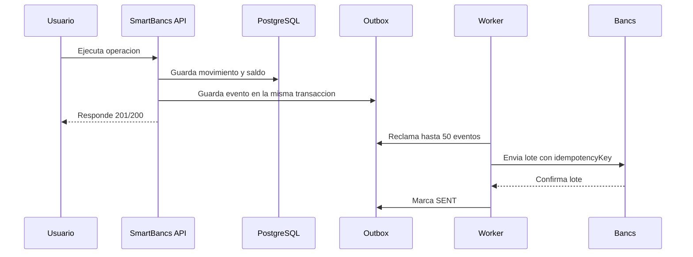

# Integracion con el core legado Bancs

## Objetivo

SmartBancs confirma las operaciones de la experiencia digital sin convertir cada lectura
del dashboard en una llamada al core legado. Bancs sigue siendo la autoridad para una
integracion real, pero se protege mediante una capa de adaptacion y procesamiento por lotes.
En este MVP se usa `MockBancsClient` para demostrar el contrato sin depender de un sistema
externo.

## Flujo de escritura



El evento Outbox no se pierde entre el commit del movimiento y el envio a Bancs. Si Bancs
esta caido, la operacion local no se deshace: el evento queda `PENDING` y el worker aplica
reintentos con backoff. Luego de cinco intentos queda `FAILED` para una intervencion o
reproceso controlado.

## Protecciones contra saturacion

- Las lecturas frecuentes se sirven desde la base local; no se consulta Bancs por cada GET.
- Las escrituras pendientes se agrupan en lotes de 50 eventos.
- El worker espera 15 segundos entre ciclos por defecto.
- `FOR UPDATE SKIP LOCKED` permite que dos workers no reclamen el mismo evento.
- Cada evento conserva `transactionId` e `idempotencyKey`; el adaptador debe reenviar esos
  valores al Bancs real para que un timeout no duplique una operacion.
- Los reintentos usan espera creciente y dejan de llamar cuando se alcanza el maximo.

## Estados y observabilidad

La tabla `bancs_outbox` usa los estados `PENDING`, `PROCESSING`, `SENT` y `FAILED`.
El estado se puede consultar con un usuario autenticado:

```http
GET /integration/bancs/status
```

Ejemplo:

```json
{
  "pendingEvents": 0,
  "processingEvents": 0,
  "sentEvents": 12,
  "failedEvents": 0,
  "lastSuccessfulSync": "2026-09-20T15:30:00Z"
}
```

## Migracion

Para una base nueva, `database/init/database.sql` crea el esquema principal y la tabla
Outbox en el orden correcto. Para una base existente que ya fue inicializada antes de este
cambio, aplicar manualmente el bloque Outbox de ese mismo archivo o recrear el volumen:

```powershell
docker compose down -v
docker compose up -d
```

El cliente real puede reemplazar `MockBancsClient` sin cambiar el servicio transaccional.
La llamada real debe incluir timeout, autenticacion de servicio, trazabilidad y un contrato
versionado con el equipo propietario de Bancs.
